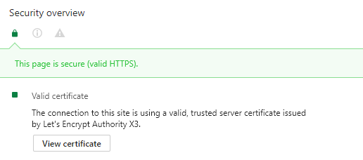

# Docker Flow: Let's Encrypt

This companion service creates and renews Let's Encrypt Certificates and reconfigures [Docker Flow: Proxy](https://github.com/vfarcic/docker-flow-proxy) and [Docker Flow: Swarm Listener](https://github.com/vfarcic/docker-flow-swarm-listener) so that all services which should be accessible via Docker Flow Proxy are available via HTTPS (SSL/TLS).

## About Let's Encrypt

[Let's Encrypt](https://letsencrypt.org/) is a free, automated, and open certificate authority (CA), run for the public’s benefit. It is a service provided by the Internet Security Research Group (ISRG). It is free, automatic, secure, transparent, open and cooperative.
With Let's Encrypt we can create certificates, which were then signed by them. All Operating Systems and Browsers who trust Let's Encrypt automatically accept certificates signed by them. 

In short: 

A Certificate is 

